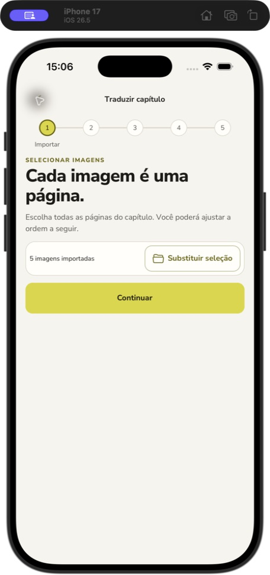

# Continuar com imagens existentes — 2026-08-30

Correção dos contratos de navegação e preservação de estado de MOB-FEAT-028.
O botão primário aparece abaixo do resumo de seleção e abre `organize` sem
chamar o seletor nem alterar o draft. Substituir seleção continua secundário.

## Verificação automatizada

Comandos executados em `mobile/`:

| Comando             | Resultado                                                    |
| ------------------- | ------------------------------------------------------------ |
| `pnpm test:ci`      | 87 suítes, 481 testes, zero falhas                           |
| `pnpm typecheck`    | pass                                                         |
| `pnpm lint`         | pass                                                         |
| `pnpm lint:fsd`     | pass, zero violações                                         |
| `pnpm format:check` | pass                                                         |
| `pnpm check`        | bloqueado por checksums divergentes de reviews preexistentes |

Regressão reproduzível:

```sh
pnpm test:ci --runTestsByPath src/features/import-local-media/ui/__tests__/ImportLocalMediaPanel.test.tsx src/pages/offline-translation/ui/__tests__/OfflineTranslationPage.test.tsx
```

Antes da implementação: 7 falhas e 9 sucessos, incluindo ausência do botão e
impossibilidade de voltar à organização sem substituir. Após a correção, os
16 testes dessas duas suítes passam, incluindo:

- retomada do rascunho, retorno à importação e continuidade com os mesmos itens,
  ordem e metadados, sem confirmação, alteração de arquivos ou HTTP;
- ausência da ação sem imagens ou sem callback;
- bloqueio durante carregamento/importação;
- continuidade após cancelamento e falha da substituição com seleção preservada;
- copy acessível em pt-BR, en-US e es-ES;
- preservação da importação nova com avanço automático e confirmação de ordem.

## Verificação nativa

iPhone 17 Simulator, iOS 26.5, tema claro, retrato, usando o rascunho existente:

1. Abrir Traduzir capítulo retoma Organizar com cinco páginas.
2. Voltar mostra Importar, cinco imagens importadas, Substituir seleção e Continuar.
3. Tocar Continuar abre Organizar sem picker; os cinco identificadores de página
   e suas posições na árvore de acessibilidade permanecem iguais.



A auditoria de fonte ampliada foi iniciada com seis incrementos até
`accessibility-extra-large`. O controle da janela falhou com
`Computer Use server error -10005: noWindowsAvailable` antes da inspeção do botão
após rolagem. Essa condição não foi registrada como aprovação visual. O tamanho
original `large` foi restaurado ao terminar. Revalidação em 320×568 e com fonte
ampliada continua pendente; não foram fabricadas evidências para esses casos.

## Limites dos gates

O `specs:check` já falhava antes da correção. Na execução atual, seus 23 testes
passam e a validação final aponta somente checksums divergentes nas reviews de
MOB-FEAT-012..016, 028..040 e 042..043 (sem 041). Nenhum checksum de outra feature
foi alterado para eliminar esses erros. O `pnpm check` para nesse gate; os demais
checks acima foram executados separadamente.

As tasks 010, 015 e 016 foram reabertas e o estado de MOB-FEAT-028 passou a
`verification-pending`, preservando os registros históricos de implementação.
